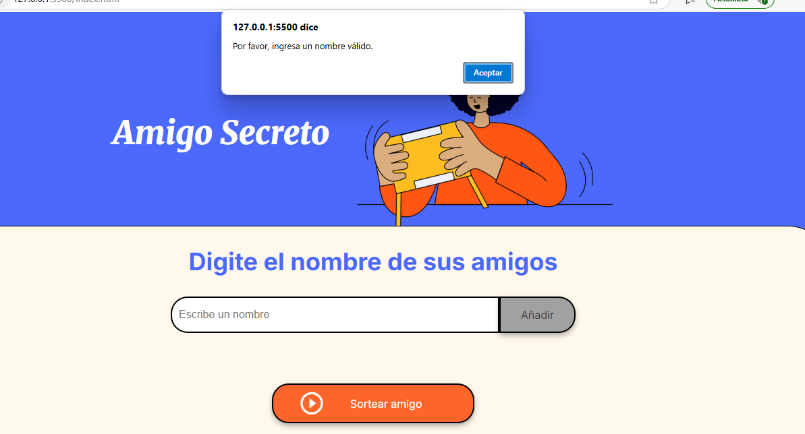
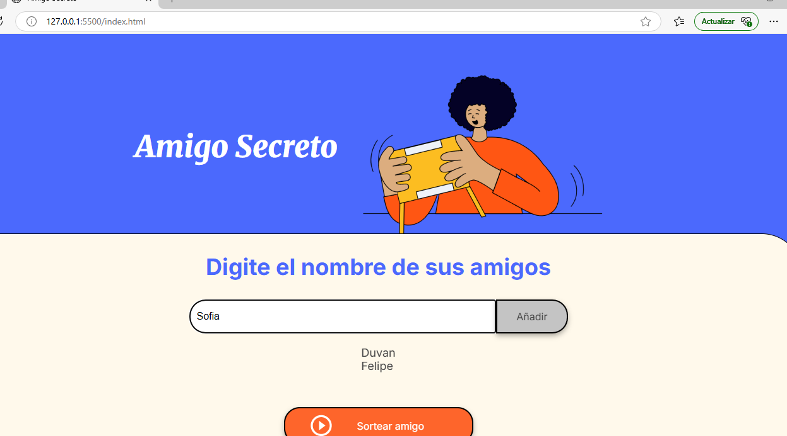
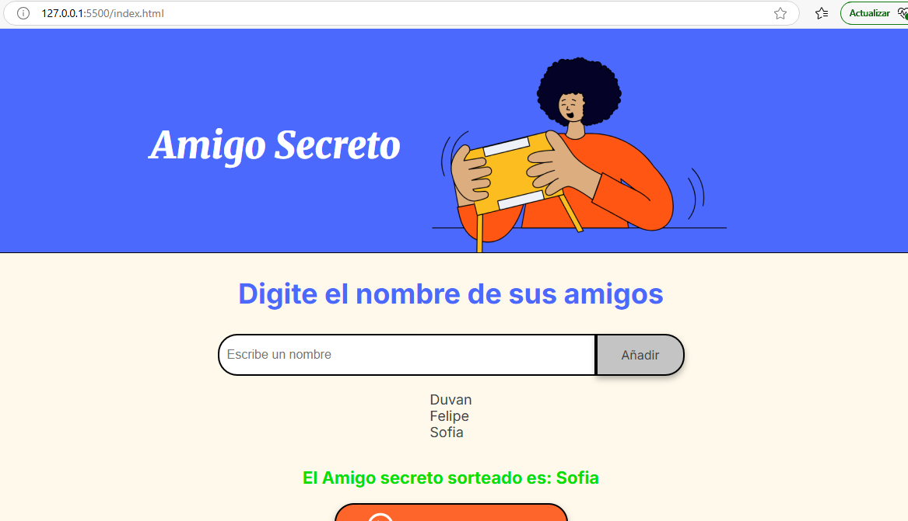

# Alura-ChallengeAmigoSecreto

Este proyecto es una aplicación web interactiva donde los usuarios pueden ingresar los nombres de sus amigos y generar de manera automática un **sorteo de Amigo Secreto**.  

## Funcionalidades  
- Permite ingresar nombres de amigos a una lista.  
- Muestra los participantes agregados.  
- Genera un sorteo de Amigo Secreto aleatorio.  
  

## Uso
1️- Ingresa los nombres de los participantes.  
2️- Haz clic en el botón "Añadir" para agregarlos a la lista.  
3️- Una vez que todos los amigos estén ingresados, inicia el sorteo.  
4️- El sistema generará automáticamente las parejas de Amigo Secreto.  

## Capturas de Pantalla  

###  Campo del nombre sin información  
  

###  Agregando amigos  
  

###  Sorteo de Amigo Secreto  
  

